# Oplot is a repository for all our existing and future python plotting related tools.

Feel free to modify/improve any of the functions. Most of them are work in progress
yet already very convenient. Below is a demo of the type of plots you can get.


# matrix.py

```python
import pandas as pd
from oplot import heatmap 
d = pd.DataFrame(
    [
        {'A': 1, 'B': 3, 'C': 1},
        {'A': 1, 'B': 3, 'C': 2},
        {'A': 5, 'B': 5, 'C': 4},
        {'A': 3, 'B': 2, 'C': 2},
        {'A': 1, 'B': 3, 'C': 3},
        {'A': 4, 'B': 3, 'C': 1},
        {'A': 5, 'B': 1, 'C': 3},
    ]
)
heatmap(d)
```


Lot's more control is available. Signature is
```python
(X, y=None, col_labels=None, figsize=None, cmap=None, return_gcf=False, 
ax=None, xlabel_top=True, ylabel_left=True, xlabel_bottom=True, 
ylabel_right=True, **kwargs)

```

# multiplots.py

The multiplots module contains functions to make "grid like" plot made of 
several different plots. The main parameter is an iterator of functions, each 
taking an ax as input and drawing something on it.

For example:
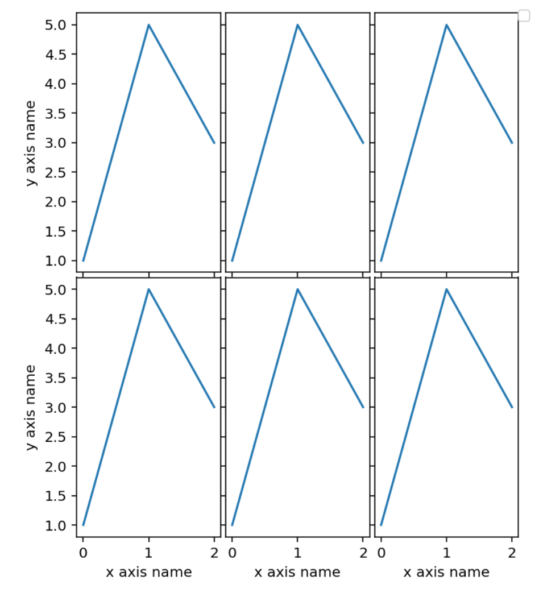

```
from oplot import ax_func_to_plot

# ax_func just takes a matplotlib axix and draws something on it
def ax_func(ax):
    ax.plot([1, 5, 3])

# with an iterable of functions like ax_func, ax_func_to_plot makes 
# a simple grid plot. The parameter n_per_row control the number of plots 
# per row
ax_func_to_plot([ax_func] * 6,
                n_per_row=3,
                width=5,
                height_row=3,
                x_labels='x axis name',
                y_labels='y axis name',
                outer_axis_labels_only=True)
```


In some cases, the number of plots on the grid may be large enough to exceed
the memory limit available to be saved on a single plot. In that case the function
multiplot_with_max_size comes handy. You can specify a parameter
max_plot_per_file, and if needed several plots with no more than that many
plots will be created.


# ui_scores_mapping.py

The module contains functions to make "sigmoid like" mappings. The original 
and main intent is to provide function to map outlier scores to a bounded range,
typically (0, 10). The function look like a sigmoid but in reality is linear 
over a predefined range, allowing for little "distortion" over a range of
particular interest.


```
from oplot import make_ui_score_mapping
import numpy as np

# the map will be linear in the range 0 to 5. By default the range
# of the sigmoid will be (0, 10)
sigmoid_map = make_ui_score_mapping(min_lin_score=0, max_lin_score=5)

x = np.arange(-10, 15)
y = [sigmoid_map(i) for i in x]

plt.plot(x, y)
```


# outlier_scores.py

This module contains functions to plot outlier scores with colors corresponding
to chosen thresholds.

```
from oplot import plot_scores_and_zones

scores = np.random.random(200)
plot_scores_and_zones(scores, zones=[0, 0.25, 0.5, 0.9])
```
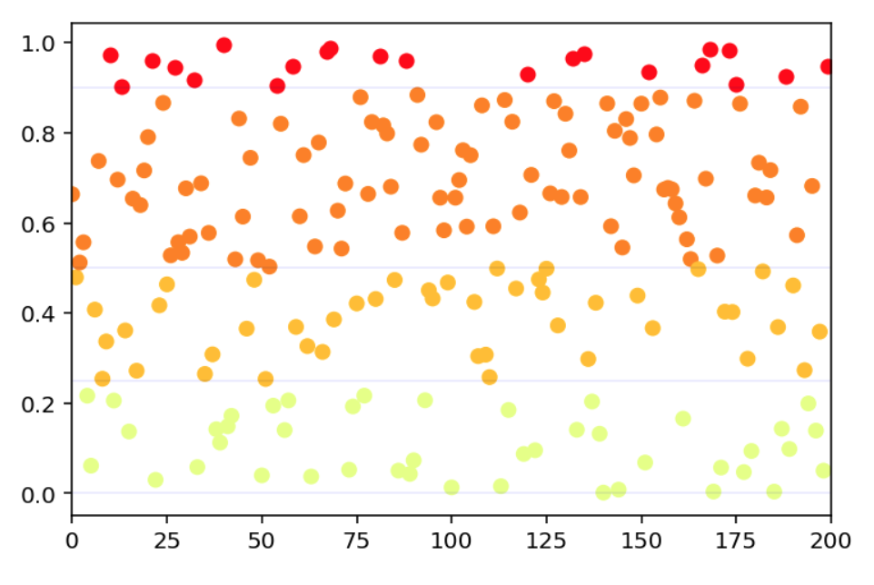

find_prop_markers, get_confusion_zone_percentiles and get_confusion_zones_std provides tools
to find statistically meaningfull zones.


# plot_audio.py

Here two functions of interest, plot_spectra which does what the name implies,
and plot_wf_and_spectro which gives two plots on top of each others:

a) the samples of wf over time

b) the aligned spectra

Parameters allows to add vertical markers to the plot like in the example below.

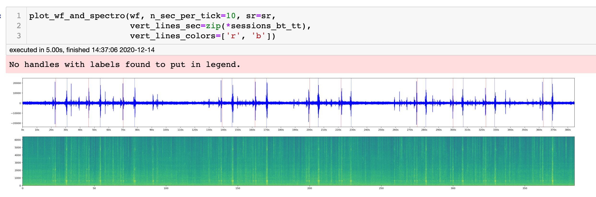


# plot_data_set.py

The main function here is scatter_and_color_according_to_y, which makes a 2d
or 3d scatter plot with color representing the class. The dimension reduction 
is controled by the paramters projection and dim_reduct.

from oplot.plot_data_set import scatter_and_color_according_to_y
from sklearn.datasets import make_classification

```
from oplot import scatter_and_color_according_to_y

X, y = make_classification(n_samples=500,
                           n_features=20,
                           n_classes=4,
                           n_clusters_per_class=1)

scatter_and_color_according_to_y(X, y,
                                 projection='2d',
                                 dim_reduct='PCA')
```


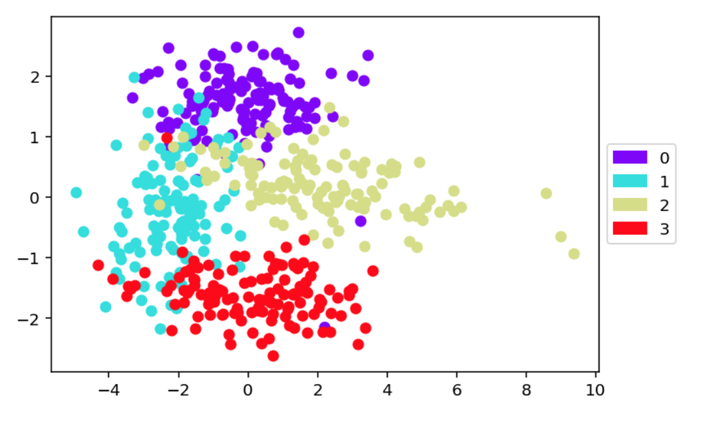

```
from oplot import scatter_and_color_according_to_y

scatter_and_color_according_to_y(X, y,
                                 projection='3d',
                                 dim_reduct='LDA')
```


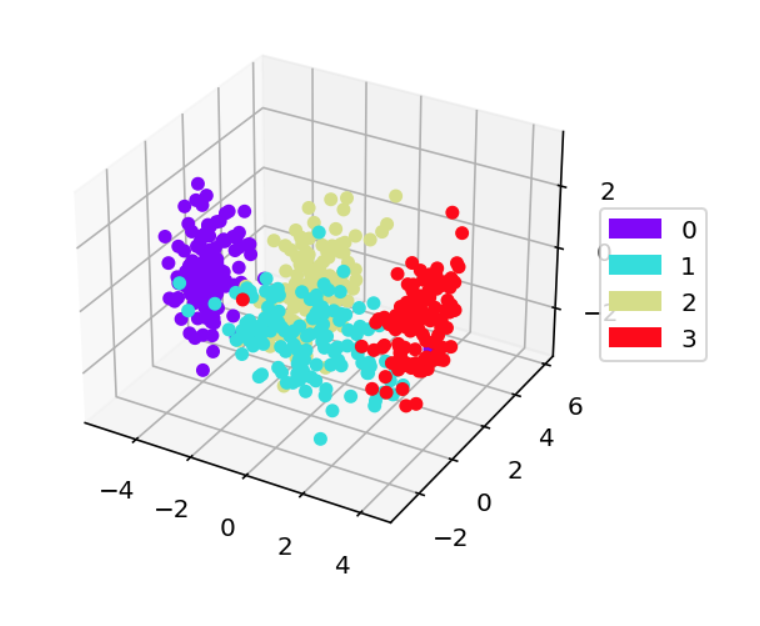

There is also that little one, which I don't remeber ever using and needs some work:

```
from oplot import side_by_side_bar

side_by_side_bar([[1,2,3], [4,5,6]], list_names=['you', 'me'])
```

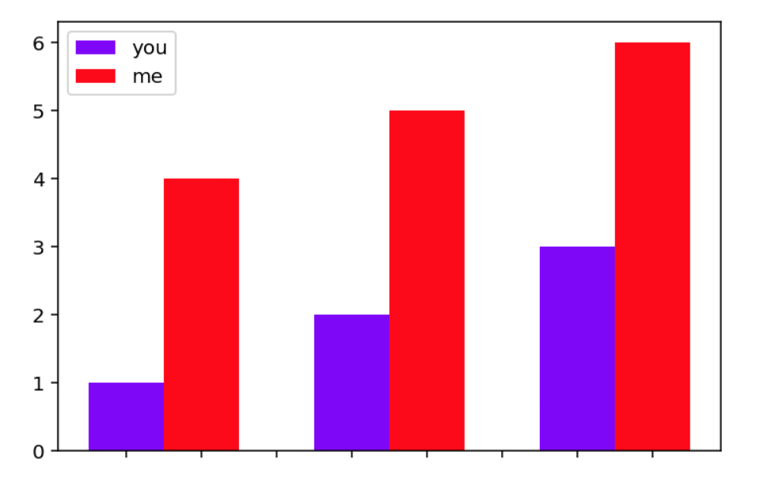


## plot_stats.py

This module contains functions to plot statistics about datasets or model
results.
The confusion matrix is a classic easy one, below is a modification of an
sklearn function:

```
from oplot.plot_stats import plot_confusion_matrix
from sklearn.datasets import make_classification

X, truth = make_classification(n_samples=500,
                               n_features=20,
                               n_classes=4,
                               n_clusters_per_class=1)
    
# making a copy of truth and messing with it
y = truth.copy()
y[:50] = (y[:50] + 1) % 4

plot_confusion_matrix(y, truth)
```
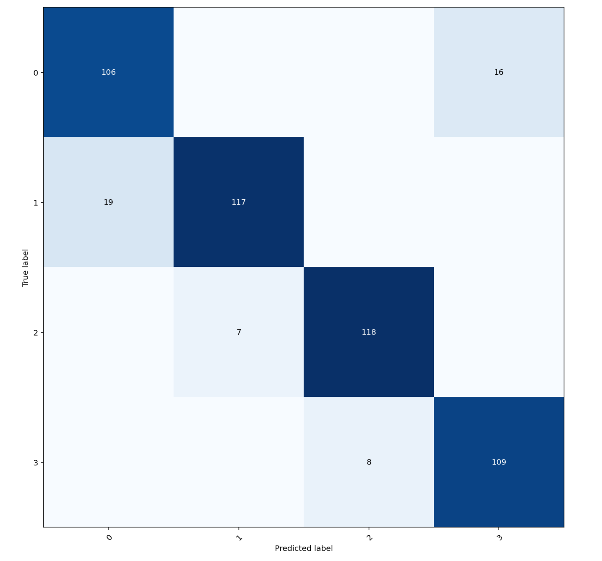

make_normal_outlier_timeline plots the scores with a color/legend given by
the aligned list truth

```
from oplot.plot_stats import make_normal_outlier_timeline

scores = np.arange(-1, 3, 0.1)
tags = np.array(['normal'] * 20 + ['outlier'] * 15 + ['crazy'] * (len(scores) - 20 - 15))
make_normal_outlier_timeline(tags, scores)
```

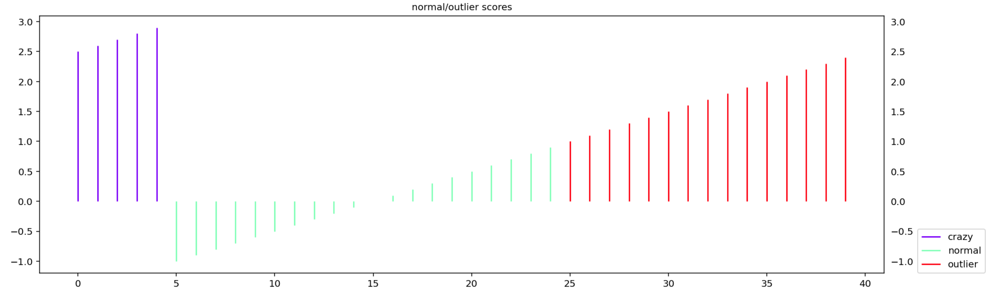


make_tables_tn_fp_fn_tp is convenient to obtain True Positive and False Negative
tables. The range of thresholds is induced from the data.

```
from oplot.plot_stats import make_tables_tn_fp_fn_tp

scores = np.arange(-1, 3, 0.1)
truth = scores > 2.5
make_tables_tn_fp_fn_tp(truth, scores)
```
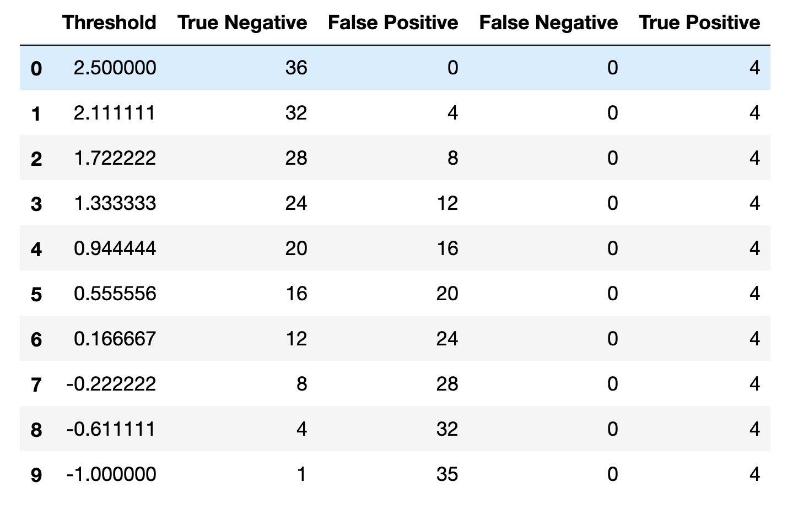

render_mpl_table takes any pandas dataframe and turn it into a pretty plot 
which can then be saved as a pdf for example.

```
from oplot.plot_stats import make_tables_tn_fp_fn_tp, render_mpl_table

scores = np.arange(-1, 3, 0.1)
truth = scores > 2.5
df = make_tables_tn_fp_fn_tp(truth, scores)
render_mpl_table(df)
```
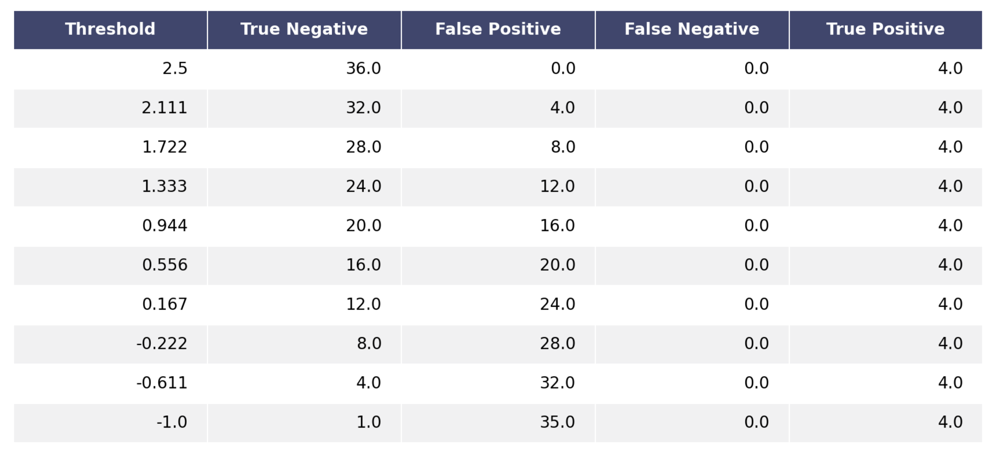

plot_outlier_metric_curve plots ROC type. You specify which pair of statistics
you want to display along with a list of scores and truth (0 for negative, 1 for positive).
The chance line is computed and displayed by default and the total area is returned.

```
from oplot.plot_stats import plot_outlier_metric_curve

# list of scores with higher average scores for positive events
scores = np.concatenate([np.random.random(100), np.random.random(100) * 2])
truth = np.array([0] * 100 + [1] * 100)

pair_metrics={'x': 'recall', 'y': 'precision'}
plot_outlier_metric_curve(truth, scores,
                          pair_metrics=pair_metrics)
```
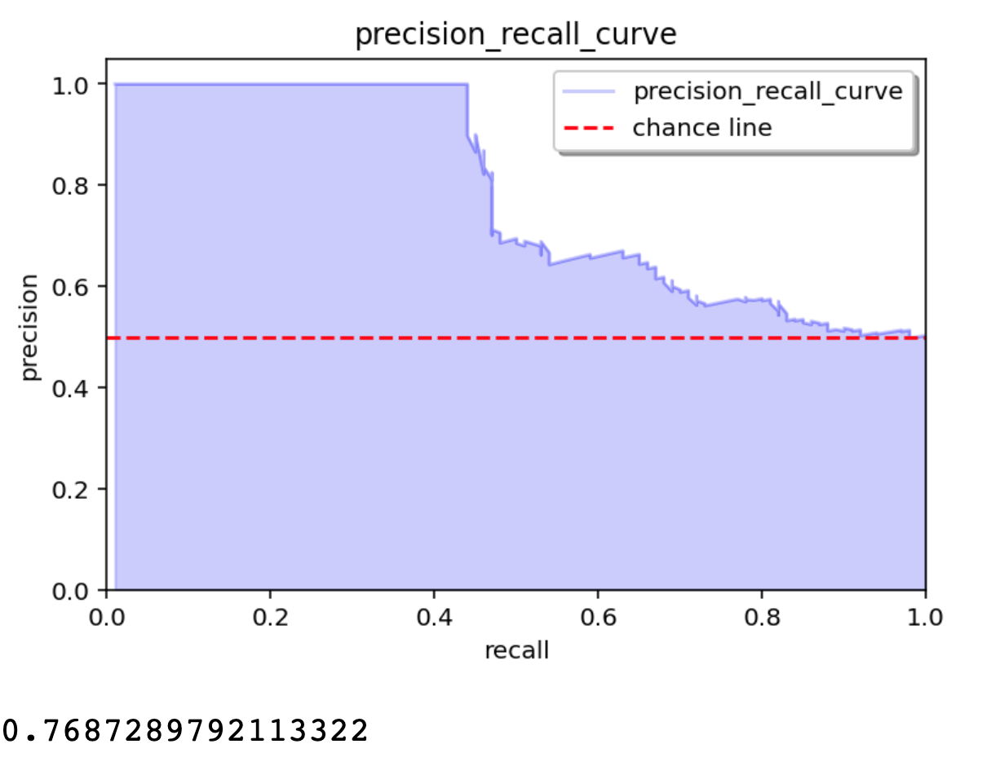


There are many choices for the statistics to display, some pairs making more or
less sense, some not at all.

```
from oplot.plot_stats import plot_outlier_metric_curve

pair_metrics={'x': 'false_positive_rate', 'y': 'false_negative_rate'}
plot_outlier_metric_curve(truth, scores,
                          pair_metrics=pair_metrics)
```
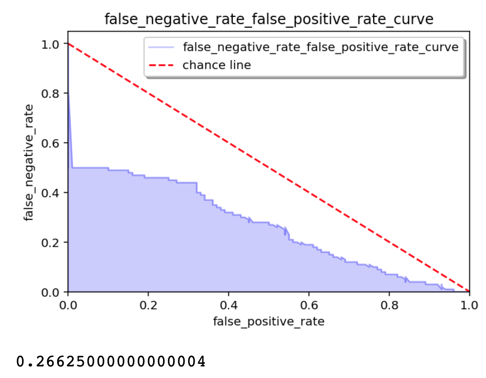


The full list of usable statistics along with synonymous:

```
# all these scores except for MCC gives a score between 0 and 1.
# I normalized MMC into what I call NNMC in order to keep the same scale for all.
base_statistics_dict = {'TPR': lambda tn, fp, fn, tp: tp / (tp + fn),
                        # sensitivity, recall, hit rate, or true positive rate
                        'TNR': lambda tn, fp, fn, tp: tn / (tn + fp),  # specificity, selectivity or true negative rate
                        'PPV': lambda tn, fp, fn, tp: tp / (tp + fp),  # precision or positive predictive value
                        'NPV': lambda tn, fp, fn, tp: tn / (tn + fn),  # negative predictive value
                        'FNR': lambda tn, fp, fn, tp: fn / (fn + tp),  # miss rate or false negative rate
                        'FPR': lambda tn, fp, fn, tp: fp / (fp + tn),  # fall-out or false positive rate
                        'FDR': lambda tn, fp, fn, tp: fp / (fp + tp),  # false discovery rate
                        'FOR': lambda tn, fp, fn, tp: fn / (fn + tn),  # false omission rate
                        'TS': lambda tn, fp, fn, tp: tp / (tp + fn + fp),
                        # threat score (TS) or Critical Success Index (CSI)
                        'ACC': lambda tn, fp, fn, tp: (tp + tn) / (tp + tn + fp + fn),  # accuracy
                        'F1': lambda tn, fp, fn, tp: (2 * tp) / (2 * tp + fp + fn),  # F1 score
                        'NMCC': lambda tn, fp, fn, tp: ((tp * tn - fp * fn) / (
                                (tp + fp) * (tp + fn) * (tn + fp) * (tn + fn)) ** 0.5 + 1) / 2,
                        # NORMALIZED TO BE BETWEEN 0 AND 1 Matthews correlation coefficient
                        'BM': lambda tn, fp, fn, tp: tp / (tp + fn) + tn / (tn + fp) - 1,
                        # Informedness or Bookmaker Informedness
                        'MK': lambda tn, fp, fn, tp: tp / (tp + fp) + tn / (tn + fn) - 1}  # Markedness

synonyms = {'TPR': ['recall', 'sensitivity', 'true_positive_rate', 'hit_rate', 'tpr'],
            'TNR': ['specificity', 'SPC', 'true_negative_rate', 'selectivity', 'tnr'],
            'PPV': ['precision', 'positive_predictive_value', 'ppv'],
            'NPV': ['negative_predictive_value', 'npv'],
            'FNR': ['miss_rate', 'false_negative_rate', 'fnr'],
            'FPR': ['fall_out', 'false_positive_rate', 'fpr'],
            'FDR': ['false_discovery_rate', 'fdr'],
            'FOR': ['false_omission_rate', 'for'],
            'TS': ['threat_score', 'critical_success_index', 'CSI', 'csi', 'ts'],
            'ACC': ['accuracy', 'acc'],
            'F1': ['f1_score', 'f1', 'F1_score'],
            'NMCC': ['normalized_Matthews_correlation_coefficient', 'nmcc'],
            'BM': ['informedness', 'bookmaker_informedness', 'bi', 'BI', 'bm'],
            'MK': ['markedness', 'mk']}
```


